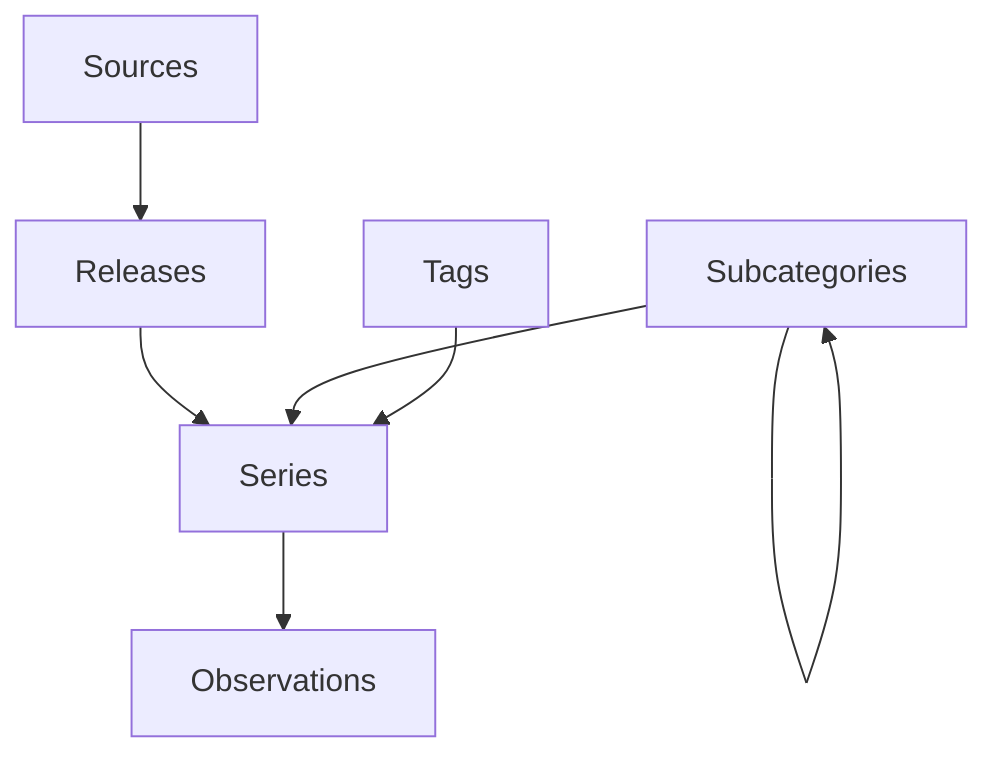

# Generic API Discovery and Collection Process

## 🎯 Overview

This document describes a universal process for discovering, analyzing, and collecting data from any REST API, with specific focus on economic data APIs (FRED, Eurostat, Bank of Japan, World Bank, IMF, etc.).

## 📋 The 7-Step Discovery Process

### Step 1: Initial API Reconnaissance
**Goal**: Understand the API's basic structure and access requirements

```python
# Key Discovery Points:
1. Base URL and versioning scheme
2. Authentication method (API key, OAuth, public)
3. Rate limiting rules
4. Response formats (JSON, XML, CSV)
5. Documentation quality and examples
```

**Actions**:
- Read official documentation
- Identify API playground/explorer if available
- Test basic endpoint with minimal parameters
- Check for OpenAPI/Swagger specification

### Step 2: Endpoint Mapping
**Goal**: Catalog all available endpoints and their purposes

```yaml
Endpoint Categories:
  Foundation:
    - Metadata endpoints (structure, schemas)
    - Catalog/list endpoints (what's available)
    - Reference data (codes, classifications)
  
  Hierarchical:
    - Category/theme endpoints
    - Parent-child relationships
    - Navigation structures
  
  Data:
    - Time series endpoints
    - Observation/value endpoints
    - Bulk data access
  
  Relationships:
    - Cross-references
    - Links between entities
    - Tag/classification mappings
```

### Step 3: Schema Analysis
**Goal**: Understand data structures and relationships

**Key Patterns to Identify**:
1. **ID Systems**: How entities are identified (numeric, string, composite)
2. **Hierarchies**: Parent-child relationships, tree structures
3. **Common Fields**: Repeated patterns across endpoints
4. **Data Keys**: Where actual data lives in responses
5. **Metadata Structure**: How descriptive information is organized

### Step 4: Pagination Pattern Detection
**Goal**: Understand how to retrieve complete datasets

```python
Common Pagination Types:
1. Offset-based: ?offset=100&limit=50
2. Page-based: ?page=3&per_page=100  
3. Cursor-based: ?cursor=eyJpZCI6MTAwfQ
4. Link-based: Response includes 'next' URL
5. Token-based: Continuation tokens
```

### Step 5: Relationship Discovery
**Goal**: Map connections between data entities



### Step 6: Collection Strategy Design
**Goal**: Optimize data collection order and method

**Priority Matrix**:
| Priority | Data Type | Strategy | Reason |
|----------|-----------|----------|---------|
| 1 | Metadata/Structure | Complete | Foundation for everything else |
| 2 | Reference Data | Complete | Needed for relationships |
| 3 | Hierarchies | Recursive | Build navigation structure |
| 4 | Sample Data | Limited | Validate understanding |
| 5 | Full Data | Paginated | Bulk collection |

### Step 7: Implementation Generation
**Goal**: Create reusable collection code

**Generated Components**:
1. Schema definition (YAML/JSON)
2. Collector class with methods per endpoint
3. Rate limiting and retry logic
4. Data validation functions
5. Storage adapters (file, database, cloud)

## 🔧 Technical Implementation

### Generic Framework Components

```python
# 1. Discovery Framework (Abstract Base)
class APIDiscoveryFramework:
    - setup_authentication()
    - discover_endpoints()
    - analyze_endpoint()
    - detect_pagination()
    - generate_collection_strategy()
    - export_schema()

# 2. API-Specific Implementation
class SpecificAPIDiscovery(APIDiscoveryFramework):
    - Define endpoints
    - Set auth method
    - Handle special cases

# 3. Generic Collector
class GenericAPICollector:
    - Load schema
    - Collect by endpoint
    - Handle pagination
    - Manage rate limits
    - Store results
```

### Pattern Recognition Rules

```yaml
Endpoint Patterns:
  Metadata Indicators:
    - /meta, /metadata, /structure
    - /schema, /dictionary, /catalog
    - Contains: fields, dimensions, attributes
  
  Data Indicators:
    - /data, /series, /observations
    - /values, /statistics, /metrics
    - Contains: timestamps, values, measurements
  
  Hierarchy Indicators:
    - /categories, /themes, /topics
    - /children, /parent, /tree
    - Contains: parent_id, level, path

Response Patterns:
  Single Object: Direct JSON object
  Collection: Array or object with data key
  Paginated: Includes count/total/next
  Nested: Hierarchical structure
```

## 📊 Applied Examples

### FRED Pattern
```yaml
Structure: Source → Release → Series → Observations
ID System: Mixed (numeric categories, string series)
Pagination: Offset-based (limit/offset)
Key Feature: Complete category hierarchy available
Rate Limit: 120 requests/minute
```

### Eurostat Pattern
```yaml
Structure: Theme → Dataset → Dimensions → Data
ID System: String codes (dataset IDs)
Pagination: Complex (dimension filtering)
Key Feature: SDMX-JSON format, multilingual
Rate Limit: Generous public access
```

### Bank of Japan Pattern
```yaml
Structure: Category → Statistics → TimeSeries
ID System: Alphanumeric codes
Pagination: Date-range based
Key Feature: Japanese/English bilingual
Rate Limit: Reasonable public access
```

## 🚀 Quick Start Guide

### 1. For New API Discovery

```python
# Step 1: Create implementation
class NewAPIDiscovery(APIDiscoveryFramework):
    def __init__(self):
        super().__init__("APIName", "https://api.example.com", {})
    
    def setup_authentication(self):
        # Define auth method
        pass
    
    def discover_endpoints(self):
        # Define known endpoints
        return endpoints

# Step 2: Run discovery
api = NewAPIDiscovery()
api.setup_authentication()
endpoints = api.discover_endpoints()

# Step 3: Analyze sample endpoint
analysis = api.analyze_endpoint(endpoints['some_endpoint'])

# Step 4: Generate collection strategy
strategy = api.generate_collection_strategy()

# Step 5: Export and generate code
api.export_schema("api_schema.yaml")
api.generate_collection_code("generated/")
```

### 2. For Existing Schema

```python
# Use generic collector with schema
collector = GenericAPICollector("api_schema.yaml", "output/")
collector.collect_all()
```

## 📈 Optimization Strategies

### Rate Limit Management
```python
Strategies:
1. Adaptive delay: Start fast, slow down on 429s
2. Token bucket: Maintain request allowance
3. Concurrent pools: Multiple workers with shared limit
4. Time windowing: Track requests per time window
```

### Memory Management
```python
Strategies:
1. Streaming: Process data in chunks
2. Pagination size: Balance speed vs memory
3. Incremental save: Don't hold everything in memory
4. Compression: Store as compressed JSON/Parquet
```

### Error Recovery
```python
Strategies:
1. Checkpoint files: Resume from last success
2. Retry logic: Exponential backoff
3. Partial collection: Save what succeeds
4. Error catalog: Track and skip known issues
```

## 🎯 Success Metrics

| Metric | Target | Measurement |
|--------|--------|-------------|
| Discovery Coverage | >95% | Endpoints documented / Total endpoints |
| Collection Completeness | 100% | Records collected / Records available |
| API Efficiency | <80% | API calls used / Rate limit |
| Error Rate | <1% | Failed requests / Total requests |
| Processing Time | Optimal | Time taken / Data volume |

## 🔄 Continuous Improvement

1. **Version Monitoring**: Track API changes
2. **Schema Evolution**: Update on new fields/endpoints
3. **Performance Tuning**: Optimize based on metrics
4. **Error Analysis**: Learn from failures
5. **Documentation**: Keep discovery notes current

---

This process has been validated with:
- ✅ FRED (Federal Reserve Economic Data)
- ✅ Eurostat (European Statistics)
- ✅ Bank of Japan
- 🔄 Ready for: World Bank, IMF, OECD, National Statistics Offices

—DATA_ANALYST